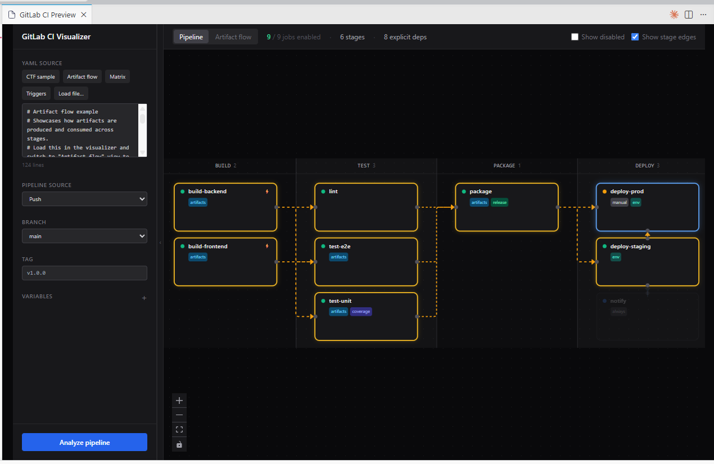

# GitLab CI Visualizer

You paste a `.gitlab-ci.yml`, tell it what to simulate (branch, pipeline source, custom variables), and it draws the graph and tells you which jobs actually run.

There's a `glvis` CLI that opens it in your browser, and a VSCode extension that opens beside your file.



---

## What it does

- Draws the pipeline as a graph with stage lanes and dependency edges
- Evaluates `rules:`, `only:`, and `except:` against whatever conditions you set
- Click a job to see the rule trace: every rule, whether it matched, what caused the job to run or be skipped
- Resolves `extends:` and expands `parallel:matrix` into individual instances shown as cards
- Shows artifact flow as a separate view: which jobs produce artifacts and how they pass through the pipeline
- Surfaces job badges for `allow_failure`, `when`, `interruptible`, `retry`, `release`, `coverage`, `pages`, `trigger`, and more
- Reads branches and CI variables from your config and offers them as suggestions
- In VSCode and the `glvis` CLI: loads the file, picks up your current git branch, and runs the analysis automatically
- With a GitLab token (`glvis login` or VSCode auth): resolves `include:` directives via the CI lint API and shows triggered downstream pipelines inline

---

## VSCode extension

Open a `.yaml` or `.yml` in VSCode, then click the preview button in the editor title bar (or run **Preview GitLab CI** from the command palette). The panel opens beside your file with the content already loaded and your current branch filled in. Analysis runs on its own, but there's a button if you need to re-run.

### GitLab integration

Run **GitLab CI: Configure Authentication** from the command palette to store a Personal Access Token. The token is kept in the same OS-keychain store the `glvis` CLI uses (keyed by instance), so logging in via the extension or `glvis login` is interchangeable — and you can store tokens for several GitLab instances at once. The extension resolves each repo against the instance its `origin` remote points at. With a token configured:

- **Analyze with GitLab** - resolves all `include:` files via the CI lint API and shows the full merged pipeline
- **Triggered downstream pipelines** - jobs with `trigger:` automatically resolve their downstream pipeline:
  - `trigger: {include: child.yml}` reads the file from your workspace (no token needed)
  - `trigger: {project: group/project}` fetches and lints the downstream project via the GitLab API
  - Click the trigger job, then **View downstream pipeline →** to navigate into it

### Installing from a .vsix file

Grab the `.vsix` for your platform from the [releases page](https://github.com/yyewolf/gitlab-ci-visualizer/releases), then:

```
code --install-extension gitlab-ci-visualizer-<platform>-0.1.0.vsix
```

---

## `glvis` CLI

```bash
# In a repo with a .gitlab-ci.yml — starts a local server on a random port,
# analyzes the file, and opens your browser.
glvis

# Point at a specific file
glvis --file path/to/.gitlab-ci.yml

# Don't open a browser (e.g. on a server)
glvis --no-browser
```

### GitLab authentication

```bash
glvis login
```

Prompts for your GitLab instance URL and a Personal Access Token (needs the
`api` scope), validates it, and stores it in your OS keychain — falling back to
`~/.config/glvis/credentials.json` (with a warning) when no keychain is
available.

Once logged in, running `glvis` in a repo whose `origin` remote points at that
instance **resolves `include:` directives and downstream `trigger:` pipelines
automatically** — no extra flag needed.

You can also pass a token per-invocation with the `GLVIS_GITLAB_TOKEN` (and
`GLVIS_GITLAB_URL`) environment variables, which take precedence over stored
credentials.

### Building the CLI from source

You need Go 1.21+ and Node 18+.

```bash
# Build the frontend (embedded into the binary)
cd web && npm install && npm run build && cd ..

# Build the CLI
go build -o glvis .
```

---

## Building from source

Requires Go 1.21+ and Node 18+.

```bash
cd vscode
npm install

# Web frontend + Go binaries for all platforms + TypeScript
npm run build

# Single .vsix with everything bundled
npm run package

# One .vsix per platform (smaller)
npm run package-all
```

`package-all` outputs:

| File | Platform |
|---|---|
| `gitlab-ci-visualizer-linux-x64-*.vsix` | Linux x86-64 |
| `gitlab-ci-visualizer-linux-arm64-*.vsix` | Linux ARM64 |
| `gitlab-ci-visualizer-darwin-x64-*.vsix` | macOS Intel |
| `gitlab-ci-visualizer-darwin-arm64-*.vsix` | macOS Apple Silicon |
| `gitlab-ci-visualizer-win32-x64-*.vsix` | Windows x86-64 |

---

## What the analyzer handles

- `rules:` - `if` expressions with `==`, `!=`, `=~`, `!~`, `&&`, `||`, null checks
- `only:` / `except:` - refs, branches, tags, merge requests, schedules, regex patterns
- `extends:` - single and multi-parent inheritance, child wins on conflicts
- `parallel:matrix` - full cartesian product, instances shown as cards on click
- `needs:` - explicit dependencies shown as direct edges; `needs[].artifacts: false` tracked
- `dependencies:` - explicit artifact source override
- `when:` - `on_success`, `on_failure`, `always`, `manual`, `never`
- `.pre` / `.post` stages - GitLab drops them when no middle-stage job runs
- `trigger:` - parsed and shown as a badge; downstream pipeline resolved with a GitLab token

`changes:` and `exists:` are both assumed true (no filesystem context).

---

## Stack

- Go: parses the YAML, evaluates rules, resolves GitLab includes/downstream, serves the API (cobra CLI)
- React + TypeScript + Tailwind + [React Flow](https://reactflow.dev/)
- VSCode extension that launches the Go server and talks to it over HTTP (binary bundled per platform)

## License

MIT
